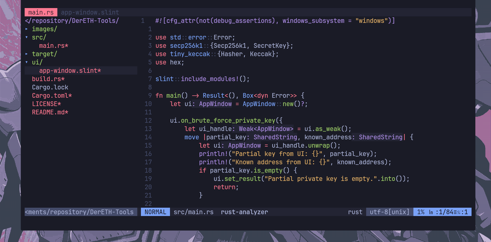
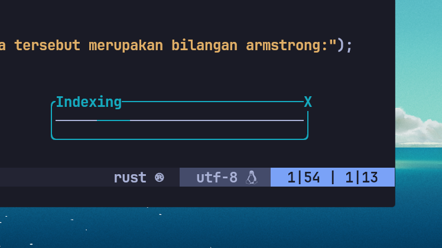
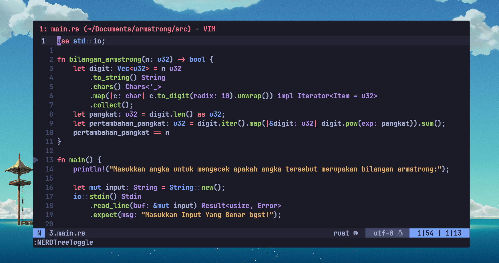
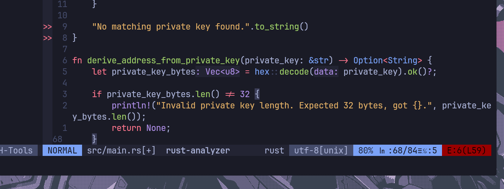

# vim-config

## How-to install:

- Install Vim-plug

``` 
curl -fLo ~/.vim/autoload/plug.vim --create-dirs \
    https://raw.githubusercontent.com/junegunn/vim-plug/master/plug.vim
```
- put the .vimrc file to your home directory, if don't exist. 

```
mv .vimrc ~/ 
```
- Put the vim files inside .vim into your .vim directory 

```
cd .vim ; mv *.vim ~/.vim 
```
- Enter Vim

- Run the following command inside vim

```
:PlugInstall
```
- Source the vimscript
```
:source .vimscript
```

- Exit vim

```
:q
```

- Re-enter vim
 
## List of plugins used:  
```
- vim-airline for StatusLine alongside vim-airline-theme.
- vim-startify by mhinz for start page.
- vim-easymotions for navigation. 
- NERDtree for file tree. 
- fzf for fuzzy finder. 
- vim-commentary 
- coc.vim for LSP, auto suggestions, many more. 
- auto-pairs by jiangmiao
- delimitMate by Raimondi
- vimtex for LaTex integration.
- vim-deviocons for nerd font integration. 
```


## Features:
- Status line plugin

## Custom startify start page and vim-devicons for NERDtree



- Custom keymaps (Will update daily for easy navigation)
- Dashboard/Start screen

## coc.vim



- LSP support.

## clean statusline with vim-airline



## Custom buffer clean display plugin integration for vim-airline 



